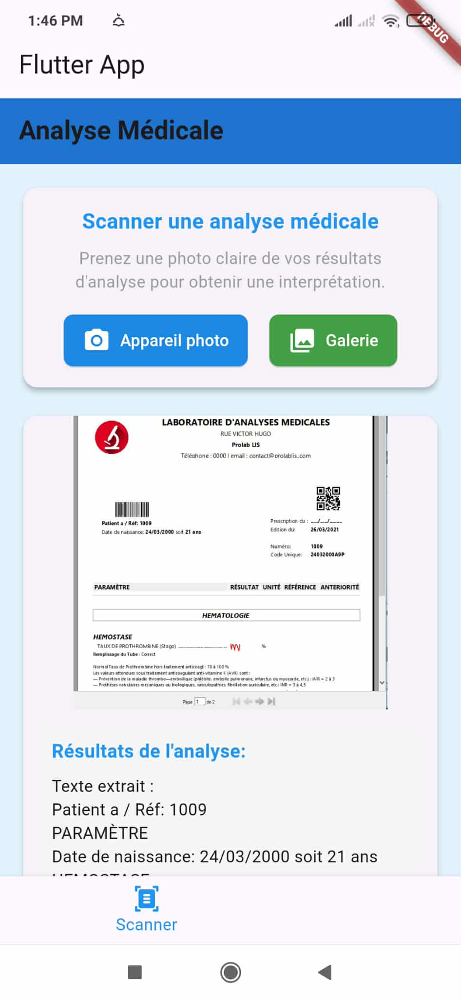

# Scan.Dr 🏥📱

> An intelligent Flutter mobile application that empowers users to scan, understand, and interpret their medical test results using advanced OCR technology and AI-powered medical analysis.

## Table of Contents
- [About](#about)
- [Features](#features)
- [Screenshots](#screenshots)
- [Technologies Used](#technologies-used)
- [Architecture](#architecture)
- [Installation](#installation)
- [Usage](#usage)
- [Medical Database](#medical-database)
- [API Configuration](#api-configuration)
- [Project Structure](#project-structure)
- [Contributing](#contributing)
- [Roadmap](#roadmap)
- [Disclaimer](#disclaimer)
- [License](#license)
- [Contact](#contact)

## About 📋

Scan.Dr is a comprehensive mobile health application designed to bridge the gap between complex medical test results and patient understanding. By combining cutting-edge OCR technology with a robust medical knowledge base, the app transforms difficult-to-understand medical documents into clear, actionable insights. Users can simply photograph their lab results and receive instant explanations of medical terms, potential condition assessments, and personalized guidance through an AI-powered medical chatbot.

## Features ✨

### Core Functionality
- **📸 Document Scanning**: High-quality image capture 
- **🔍 Advanced OCR**: Google ML Kit powered text extraction from medical test results
- **🧠 Intelligent Medical Analysis**: 
  - Automatic detection of 30+ medical terms
  - Analysis of 13 common medical conditions
  - Confidence scoring for potential diagnoses
- **💬 AI Medical Assistant**: Mistral-7B powered chatbot for medical queries
- **📊 Results Interpretation**: Clear explanations of complex medical terminology

### Additional Features
- **📅 Appointment Calendar**: Track medical appointments and test schedules
- **👤 Personal Health Profile**: Secure storage of user health information
- **🔄 Analysis History**: Review past scans and interpretations
- **🔒 Privacy-First**: Local processing for sensitive medical data

## Screenshots 📷
|-------------|-------------------|---------------|
|  |  | | 
<!-- Add your screenshots here -->
|Scanner Interface | AI Chatbot | Calendar View |
|------------------|------------|---------------|
| |  |  | 

## Technologies Used 🛠️

### Frontend & Mobile Development
- **Flutter** (Latest) - Cross-platform mobile framework
- **Dart** - Programming language
- **Material Design** - UI/UX components

### Machine Learning & AI
- **Google ML Kit** - On-device OCR and text recognition
- **Hugging Face Inference API** - Cloud-based AI processing
- **Mistral-7B-Instruct-v0.2** - Large Language Model for medical assistance

### Backend & Services
- **Firebase Core** - App initialization and configuration
- **HTTP Client** - API communication
- **Image Picker** - Camera and gallery integration

### Data Processing
- **Local Medical Database** - Offline medical term recognition
- **Pattern Matching Algorithms** - Symptom and condition correlation
- **Text Analysis** - Medical entity extraction

## Project Structure 📁

```
Scan_Dr1_new/
├── lib/
│   ├── screens/
│   │   ├── scanner_screen.dart      # Main OCR functionality
│   │   ├── chat_screen.dart         # AI chatbot interface
│   │   ├── home_screen.dart         # Dashboard
│   │   ├── profile_screen.dart      # User profile
│   │   └── calendar_screen.dart     # Appointment tracking
│   ├── services/
│   │   └── chat_service.dart        # Hugging Face API integration
│   └── main.dart                    # App entry point
├── assets/                # Images and resources
├── android/
├── ios/
└── screenshots/
```

## Installation 🚀

### Prerequisites
- **Flutter SDK**: 3.0 or higher
- **Dart SDK**: 2.17 or higher
- **Android Studio** / **VS Code** with Flutter extensions
- **Git** for version control

### Development Environment
- **Android**: API level 21+ (Android 5.0+)
- **Firebase Account** (for backend services)
- **Hugging Face Account** (for AI chatbot)

### Setup Instructions

1. **Clone the repository**
```bash
git clone https://github.com/Sirine-bit/Scan.Dr_app.git
cd Scan_Dr1_new
```

2. **Install Flutter dependencies**
```bash
flutter pub get
```

3. **Configure Firebase**
   - Create a new Firebase project
   - Download configuration files:
     - `google-services.json` → `android/app/`
     - `GoogleService-Info.plist` → `ios/Runner/`

4. **Set up Hugging Face API**
   - Create account at [Hugging Face](https://huggingface.co/)
   - Generate API token
   - Update API key in `lib/services/chat_service.dart`

5. **Run the application**
```bash
# Check for issues
flutter doctor

# Run on connected device/emulator
flutter run
```

## Usage 📱

### Scanning Medical Documents
1. Open the Scanner tab
2. Choose camera or gallery
3. Capture/select your medical test image
4. Wait for OCR processing
5. Review extracted text and analysis

### Getting Medical Insights
- **Medical Terms**: Automatic detection with explanations
- **Condition Analysis**: Percentage-based matching with symptoms
- **AI Assistance**: Ask questions about your results

### Managing Health Data
- **Profile**: Store personal health information
- **Calendar**: Track appointments and test dates
- **History**: Review previous scans and analyses

## Medical Database 📊

### Supported Medical Terms (30+)
- Blood components (Hemoglobin, Leukocytes, Platelets)
- Metabolic markers (Glucose, Cholesterol, Triglycerides)
- Kidney function (Creatinine, Urea)
- Liver function (Transaminases, Bilirubin)
- Hormones (TSH, T3, T4)
- Vitamins and minerals

### Analyzed Conditions (13)
- Anemia
- Diabetes
- Thyroid disorders
- High cholesterol
- Urinary tract infections
- Inflammation markers
- Liver disease
- Kidney dysfunction
- Vitamin deficiencies
- Infections (viral/bacterial)

## API Configuration 🔧

### Hugging Face Setup
```dart
// In lib/services/chat_service.dart
static const String apiKey = 'YOUR_HF_API_KEY_HERE';
static const String endpoint = 'https://api-inference.huggingface.co/models/mistralai/Mistral-7B-Instruct-v0.2';
```

### Firebase Configuration
- Enable Authentication (optional)
- Configure Cloud Firestore (for data storage)
- Set up Analytics (for usage tracking)


```

## Contributing 🤝

We welcome contributions! Please see our [Contributing Guidelines](CONTRIBUTING.md) for details.

### Development Workflow
1. Fork the repository
2. Create a feature branch (`git checkout -b feature/AmazingFeature`)
3. Commit changes (`git commit -m 'Add AmazingFeature'`)
4. Push to branch (`git push origin feature/AmazingFeature`)
5. Open a Pull Request

### Areas for Contribution
- Additional medical conditions and terms
- Multi-language support
- UI/UX improvements
- Performance optimizations
- Test coverage

## Roadmap 🗺️

### Version 2.0
- [ ] Multi-language support (English, Arabic)
- [ ] Custom ML model training
- [ ] Cloud storage for scan history
- [ ] Doctor consultation scheduling
- [ ] Export results to PDF

### Version 2.1
- [ ] Medication reminders
- [ ] Health trend analysis
- [ ] Family health profiles

## Testing 🧪

```bash
# Run unit tests
flutter test

# Run integration tests
flutter drive --target=test_driver/app.dart
```

## Disclaimer ⚠️

**Important Medical Disclaimer:**

Scan.Dr is designed for educational and informational purposes only. It does not provide medical advice, diagnosis, or treatment. Always consult qualified healthcare professionals for:
- Medical diagnosis and treatment decisions
- Interpretation of medical test results
- Health-related concerns or symptoms
- Medication adjustments

The app's analysis should never replace professional medical consultation.


## Contact 📧
**Sirine Makni** - *Engineering Student @ SUP'COM, Tunis*
**Email**: sirine.makni@supcom.tn  
[](https://www.linkedin.com/in/sirine-makni-9367752a3/)
[](https://github.com/Sirine-bit)


---
